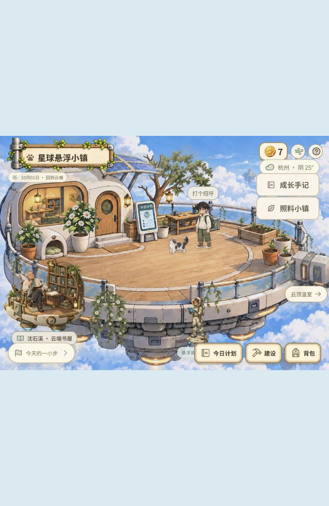
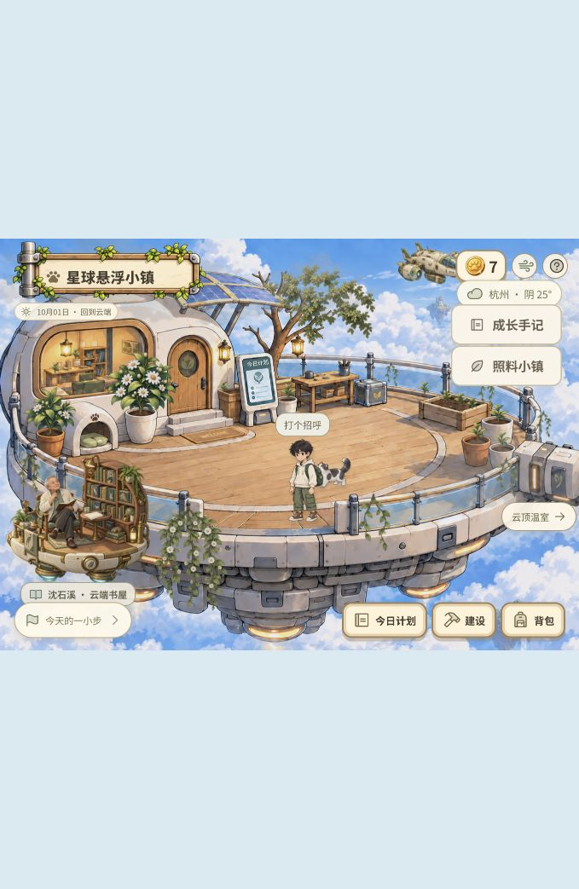
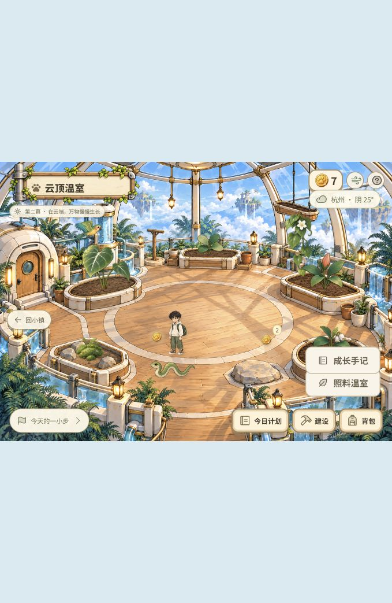
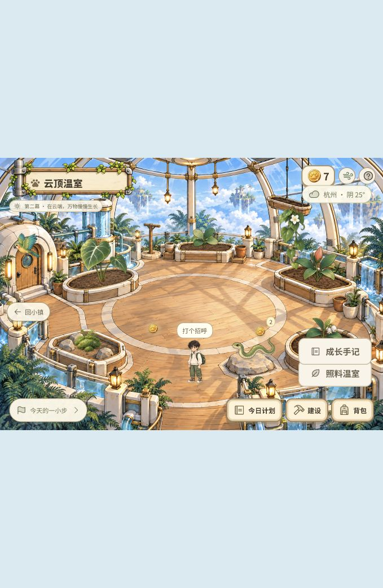

# 两幕构图与透视审查 · 2026-10-01

## 范围与结论

检查当前 Python 家庭版 `http://127.0.0.1:4180/` 的第一幕悬浮小镇、第二幕云顶温室。使用同一浏览器当前视口 679 × 1043，场景实际尺寸约 679 × 483；未调整浏览器尺寸。截图均在本次审查中采集、保存并打开检查。

整体方向可保留：环形平台、中央活动空间、四周植被与玻璃穹顶已经提供清晰的空间线索。主要问题是背景具有纵深，而叠加人物使用固定尺寸，且部分前后遮挡没有遵循空间位置。需要统一轻度透视与遮挡，不宜先把各类植物或人物单独随意放大、缩小。

本次为审查，没有修改场景运行代码、消费星球币或调整成长存档。页面动态继续运行，因此自然掉落仍可能发生；没有领取掉落或发送邮件。仅记录用户的构图要求与以下证据。

## 1. 第一幕：前后移动缺少比例变化

### 优先修正：背景透视与主角尺寸规则不一致

角色从平台后侧走向前沿时，底图的栏杆、木地面和小屋已经给出距离变化，但角色外层尺寸完全相同：

| 位置 | 脚底定位占场景高度 | 角色外层宽度 | 角色外层高度 |
| --- | ---: | ---: | ---: |
| 后侧 | 48.03% | 73.33 px | 109.99 px |
| 前沿 | 68.73% | 73.33 px | 109.99 px |

以上是 DOM 容器尺寸，包含图集透明留白，不等于人物可见身高；它用于证明同一人物移动前后的缩放规则不变。后侧的人物因此相对工作台、门口显大，来到近处又缺少自然的放大。

代码依据：`src/scene-scale.css:1–10` 明确采用固定正交比例，第一幕主角固定宽度为 10.8%。`src/PlayerCharacter.jsx` 依照位置更新坐标和层级，没有随地面纵深变化的缩放。

### 优先修正：前沿栏杆未遮住人物

第二张截图中，角色来到平台前沿，裤腿与白色栏杆交叉时，人物仍整体压在栏杆上方，削弱了“站在围栏里面”的空间感。

代码依据：`src/App.jsx:303` 将小屋、地板和栏杆统一渲染为一张背景图，角色在其上方独立渲染。前景栏杆没有可以遮挡人物的独立图层。

建议保留底图构图，为实际跨越人物的前景栏杆补充对应的遮挡层，或校准行走边界让人物不能进入错误交叉区域。透明玻璃与不透明栏杆应分开考虑，不能用整块不透明遮罩盖掉人物。

## 2. 第二幕：近景人物偏弱，动物层级需同步校准

### 需要校准：近景主角与门、栏杆的参照关系

主角来到前方通道后仍保持很小的尺寸，对照两侧近景栏杆与门框，视觉上更接近一个小模型。温室主角宽度为 8.5%，第一幕为 10.8%，相同视口下外层宽度减少约 21.3%。前景实测为 57.71 × 86.56 px，中央位置也是同一尺寸。

两个场景可以使用不同镜头范围，因此 21.3% 的差异本身不构成错误；问题是目前没有以门、栏杆及脚底位置统一校准。上一轮恢复温室 8.5% 规则只消除了 CSS 覆盖冲突，不能作为整体比例已经正确的依据。

建议先明确温室门高、扶手高度对应的人物尺度，再校准中央、后方和近景三个位置。远处空间继续显得宽敞，走向前方时主角应自然获得存在感。

### 代码确认的遮挡风险：小蛇固定在人物前面

`src/GreenhouseScene.jsx:52` 把小蛇固定为 `z-index:89`，主角则按脚底纵坐标排序。本次前景主角的层级为 83，小蛇为 89，即使蛇位于角色身后，一旦发生重叠也仍会覆盖人物。本次保存的两张温室截图没有恰好捕捉到相交瞬间，因此这是代码确认的风险，不把它描述为截图中已经发生的穿模。

应按动物与角色的地面接触位置统一排序。鹦鹉在空中，不能单纯用画面纵坐标判断距离，应另外考虑它的飞行高度与路线前后关系。

## 3. 植物与其他场景元素

- 当前观察到的种植槽、环形步道和穹顶提供了稳定构图，不需要整体重画。
- 宽叶植物高于孩子、苔藓贴近地面属于合理的物种差异，不能据此判定透视错误。校准应看盆口、根部与相邻地面，不把所有物种强行缩成同一高度。
- 第一幕云端书屋属于更近的独立悬浮平台；其 NPC 是坐姿，不能直接用整张书屋图片或坐姿总高度与站立主角比较。应以头部、肩部和座椅尺度进行后续校准。
- 悬空飞毯、飞船和鹦鹉不能按照画面“越靠下越近”统一缩放，因为画面纵坐标同时包含高度。它们需要自己的空间深度定义。

## 建议实施顺序

1. 用门、栏杆与主角确定每幕的比例参照，定义后方、中央、前景三个地面深度带。
2. 给地面角色和宠物加入轻度、连续的远近缩放，以脚底为稳定支点；缩放取实际移动位置，不取终点，也不随迈步帧变化。保持现有六帧步态的体型校准。
3. 修正前景栏杆遮挡，并统一人物、地面动物、可建设物和植物的空间排序；高处吊盆等元素单独处理。
4. 最后微调各素材本体比例与接地阴影，保留至少 44 px 的独立触摸范围，避免为方便点击而放大动物素材。

## 验证边界

本次覆盖两幕实际运行画面，以及第一幕后侧至前沿、第二幕中央至前景的移动。第一幕包含当前存档中的初生、繁茂、盛放植物；第二幕当前全部初生。没有为审查消费真实星球币，没有穷尽所有成长阶段、所有访客停靠时刻或其他设备尺寸。这些应在透视调整后用独立测试存档补齐。

原始截图目录：`docs/qa/composition-2026-10-01/`。浏览器最终保持在第二幕，服务器继续运行。
