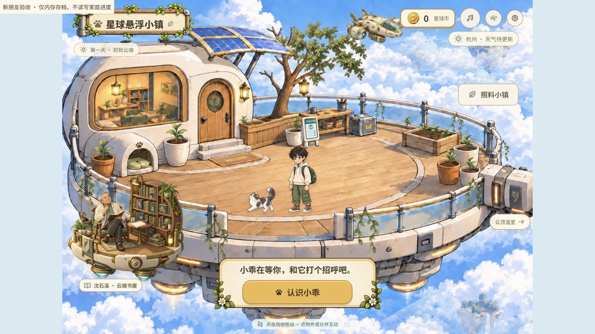
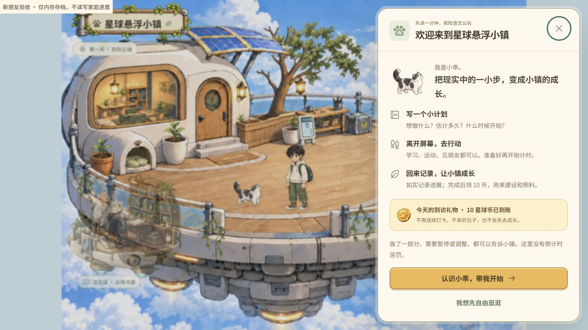
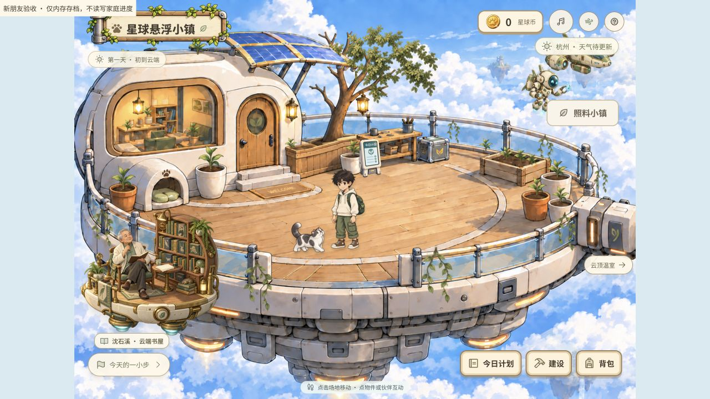
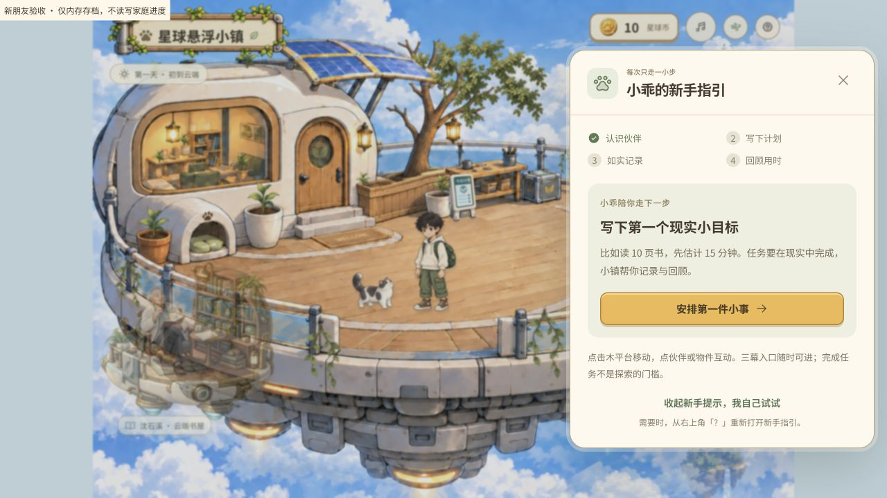
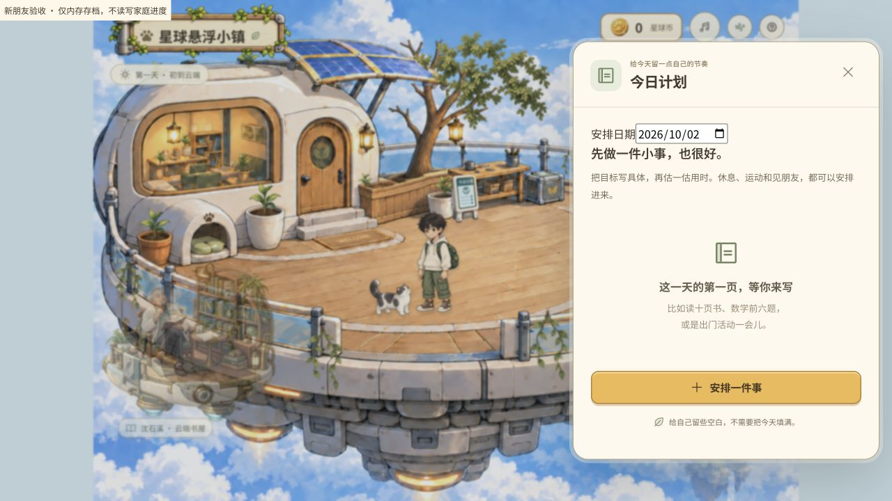
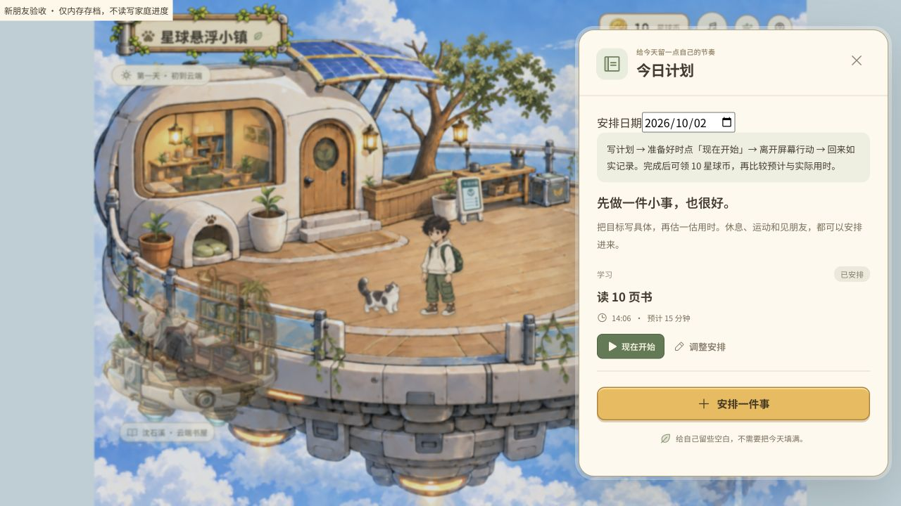
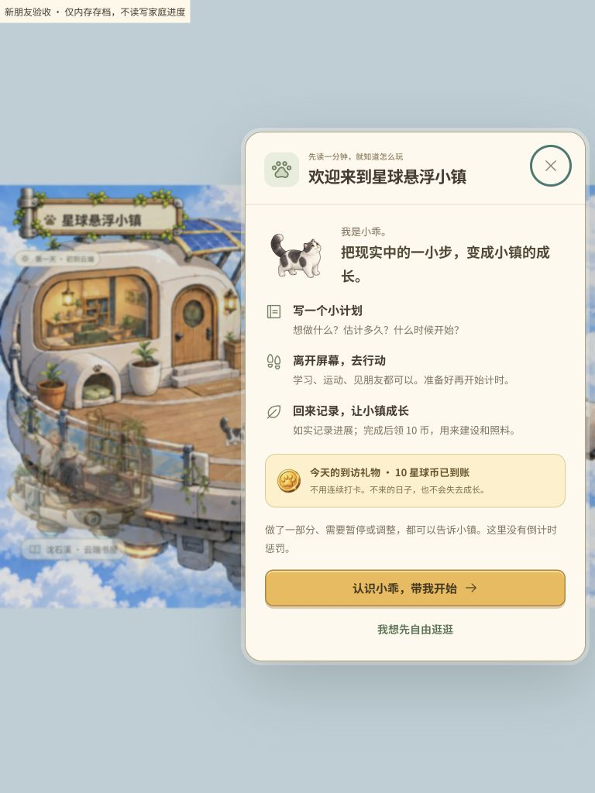

# 新手指引与到访礼物验收

本次针对“新朋友不知道时间管理游戏怎么玩”审查首次进入到首个计划的路径；沿用现有手绘场景、纸张面板和小乖素材。

## 体验审查

1. **首次进入：原先说明不足，现已补齐。** 原页只要求认识小乖，未解释现实行动与场景成长的关系。新增三段循环说明、自动到访礼物说明以及自由探索选项。
   - 原界面：
   - 调整后：
2. **认识伙伴之后：原先下一步不明显，现已连贯。** 原页将提示收进“今天的一小步”，与多种场景互动竞争。现在认识后直接出现下一步；退出后保留紧凑按钮，提示随真实任务状态变化，可收起与重开。
   - 原界面：
   - 调整后：
3. **首个计划：原有示例和自由估时保留，循环更明确。** 示例新增估时和分类，用户可修改且需确认后保存；计划页明确开始、现实行动、记录、任务奖励和用时回顾的关系。
   - 原界面：
   - 调整后：

## 实际检查

- 桌面 1280×720：认识小乖 → 选“读 10 页书 / 15 分钟” → 保存 → 开始 → 部分完成 → 通过指引继续 → 记录完成 18 分钟 → 领取任务奖励 → 回顾“比预计久一点”。部分完成保持 10 币，完成领奖后为 20 币（到访 10 + 任务 10）。均在 `docs/qa/onboarding.html` 内存存档中执行。
- iPad 768×1024：欢迎页无横向溢出，主操作与自由探索按钮均在视口中。截图：。修正面板切换后焦点落到页面时 Escape 无效的问题，Tab 可将外部焦点带回当前面板；未做完整读屏或 WCAG 合规审计。
- 独立 Python 家庭版使用临时数据目录和 localhost:4186：输入临时昵称，自动显示首日 10 币；自由探索后刷新，仍为 10 币、不会再次弹欢迎页。每日手记出现一次到访礼物，任务数仍为 0；名字与存档页仍有旧存档导入入口。
- 自动验证：前端 67 项、Python 64 项通过。其中包括 UTC+8 午夜、重复与倒退日期、缺席不补发、两个 SQLite 连接并发、重启、伪造客户端金额/时间无效、家长不触发、旧存档与到访记录合并、重复/未来/非法日期拒绝、空存档仅导入一次、实际游戏进度不覆盖，以及新手任务状态分支。
- 浏览器发现并修正过奖励提示引用页面状态的初始化顺序问题；最终家庭版重新构建。构建仍有原有主包大于 500 kB 的提示。
- 测试没有用于扣费或修改孩子实际任务；正式服务启用后，真实孩子到访会按新规则获得当天的 10 币。
