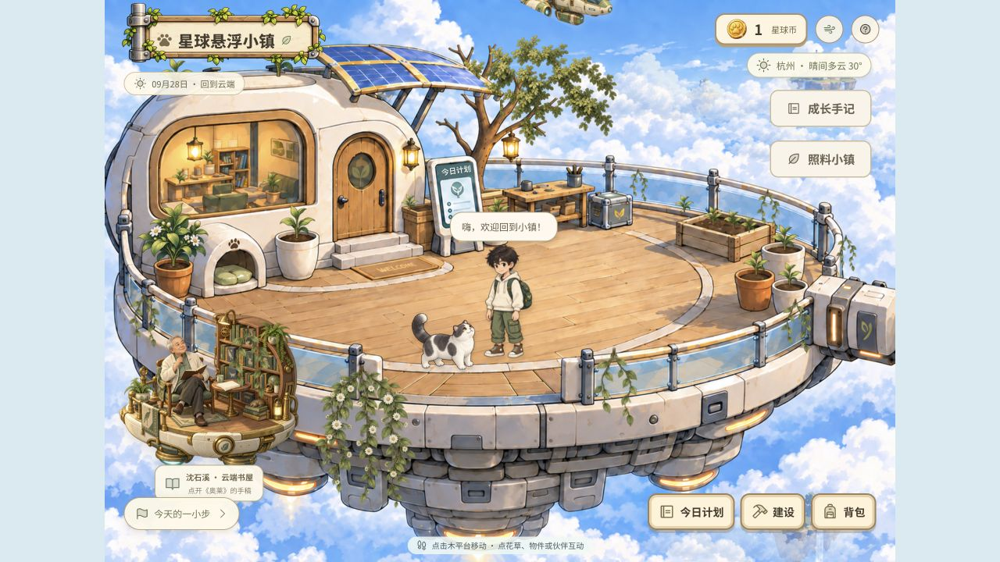
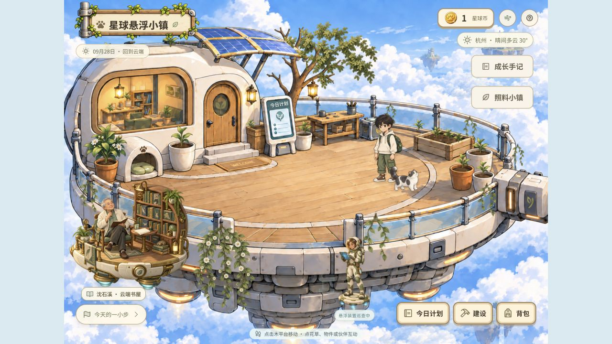
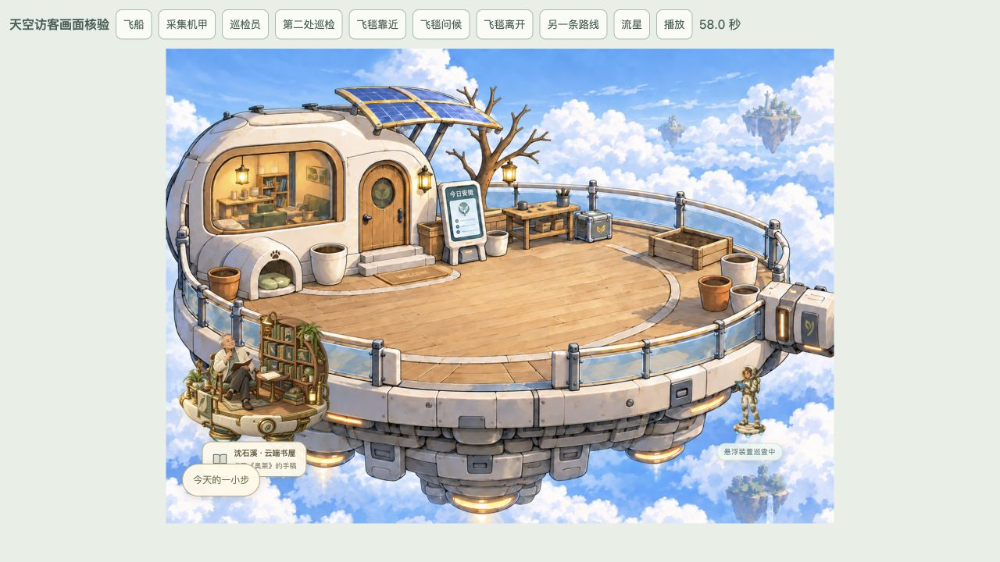
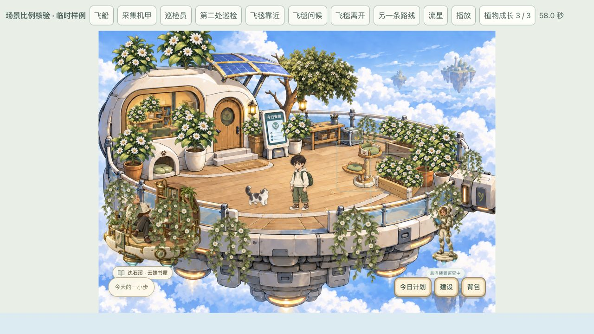
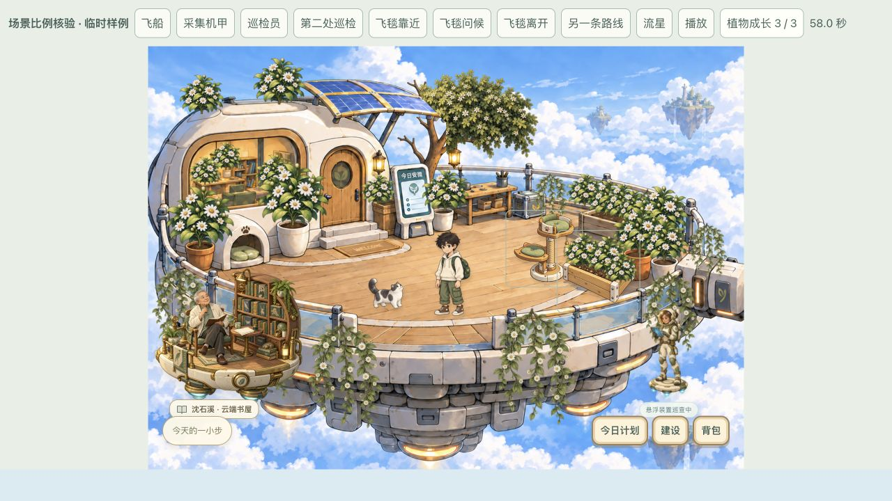
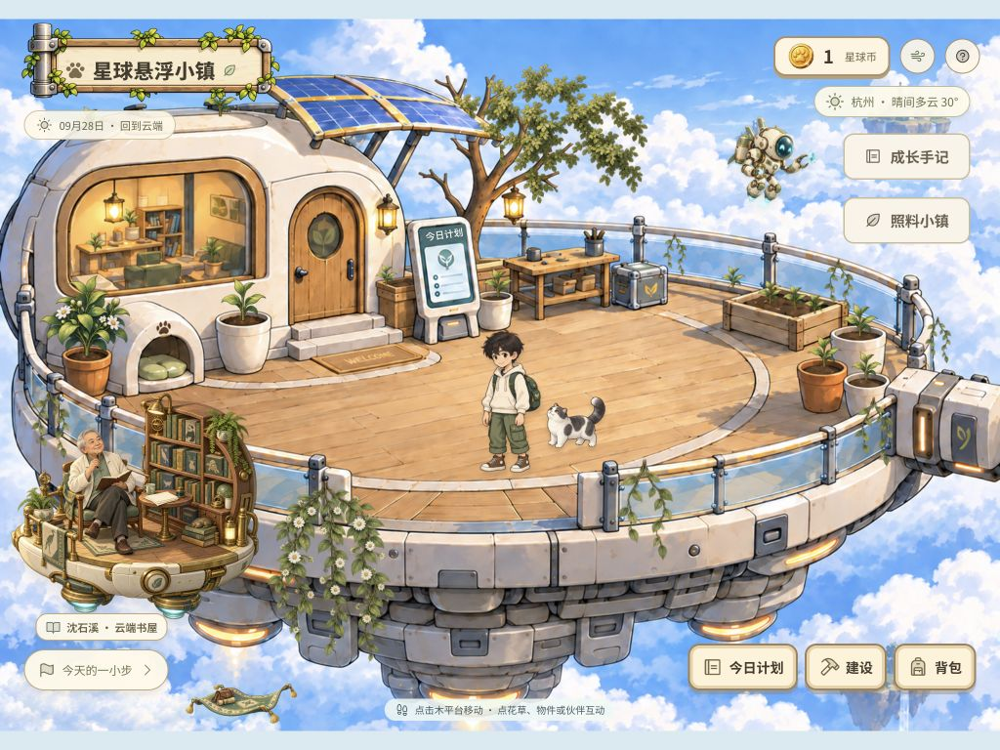
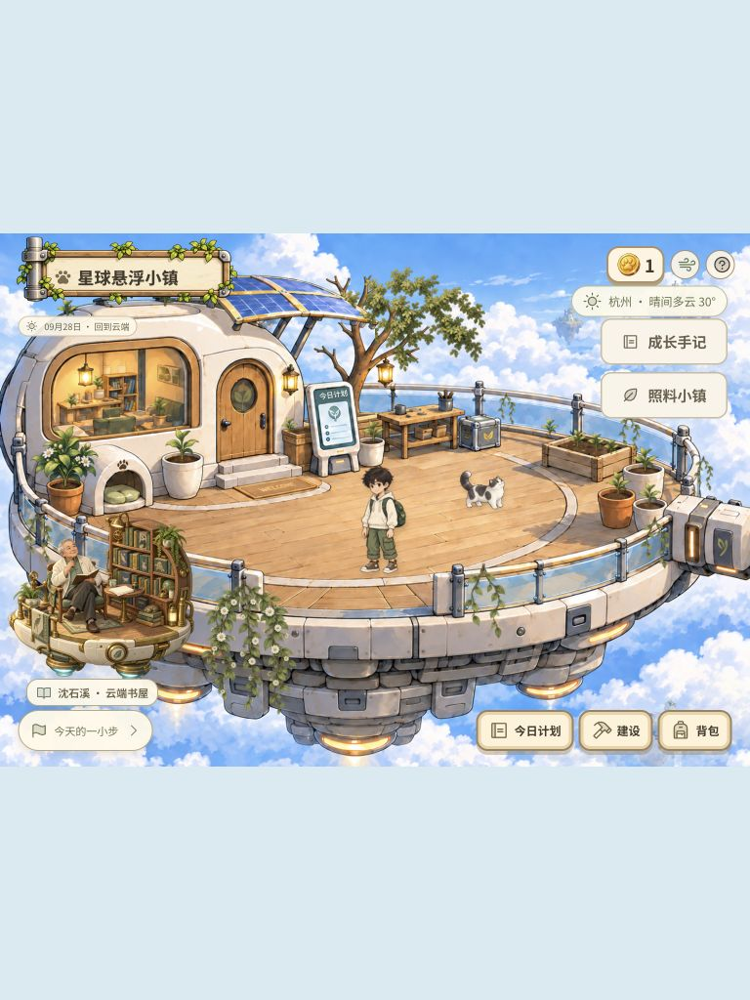
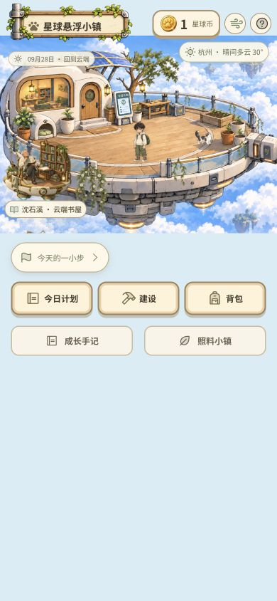
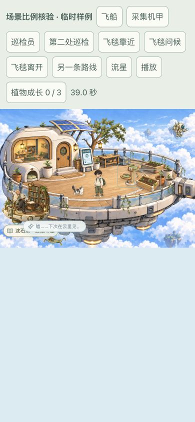
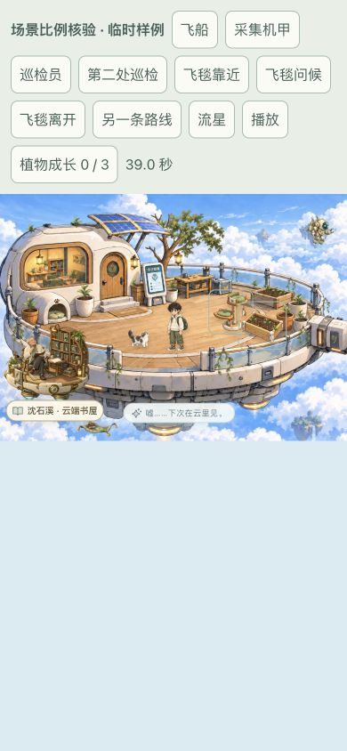

# 场景比例审查与修正

2026-09-28，本轮直接使用内置浏览器捕获当前页面。家庭版地址 `http://127.0.0.1:4180/`。

## 1. 真实主场景：统一人物与宠物的尺度

修正前，小乖身高接近主角一半；近景巡检员比主角明显矮小；成年书屋 NPC 的体量偏小。主角与住宅保留，以其为参照：小乖宽度从场景 10.2% 调至 7.4%，书屋从 24% 调至 26.2%，巡检员从 7.7% 调至 10.5%。巡检员两个停靠点微调，避免放大后碰到底部按钮。

初始巡检员单独核验画面：

## 2. 最大成长状态：修正越界与遮挡

使用实际植物、人物、访客和建设组件的临时样例，覆盖植物 0—3 阶段以及猫爬架、小花圃。样例不读写孩子的成长、币数和建造进度。

盛放时，旧屋顶花草顶部越界，前栏杆藤蔓盖住 NPC 与藏书架。现已缩小屋顶绿篱基准尺寸，并将前景书屋置于栏杆植物之前。铭牌收为紧凑一行。

## 3. 适配屏幕与飞毯问候

浏览器实际视口核验：桌面 1280×720、iPad 横屏 1024×768、竖屏 768×1024、小屏 390×844。全部无横向溢出，书屋铭牌与主要入口分开。小乖在 390px 宽度下本体为 28.86px 宽，透明点击范围仍有 44×44px。

固定访客时钟 39 秒检查问候阶段：发现窄场景中的问候气泡与铭牌相叠。现根据场景容器宽度，将气泡移到飞毯右侧；DOM 矩形交叠检测为 false。

## 验证

- 家庭版实际点击地面：出现 walk 状态和可见迈步帧，位置连续变化，到达后回到 idle。
- 点击小乖：出现 hop 和“喵～陪我玩一会儿”，提供照料入口；暂停后仍显示“蹭蹭，今天也喜欢你”。测试后恢复原有开启动态设置。
- 书屋入口正常打开原创手稿；前栏杆长垂藤入口正常打开盛放照料面板，已有成长等级保留。
- `npm test`：26 项通过；标准前端与家庭版构建通过。
- 当前服务保持运行。未扣费、未增加测试币或写入植物成长/建造测试数据。

## 范围与限制

画面继续使用已有 ImageGen 手绘素材和原主平台构图。保留远景飞船与采集机甲的较小尺度；近景人物采用统一参照。样例截图用于极端成长与固定访客阶段检查，不代表孩子的实际存档。

响应式检查使用浏览器视口，未在实体 iPad Safari 上操作；不据此声称完整无障碍符合性。非常小的植物仍可通过“照料小镇”目录选择。截图记录动态的一个时刻；未穷举全部移动路径和植物组合。
