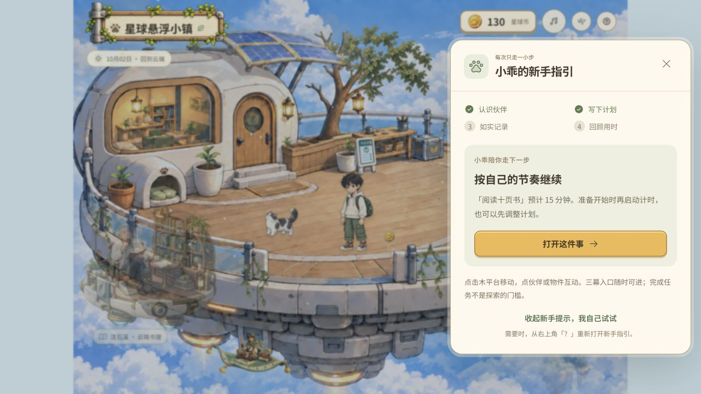
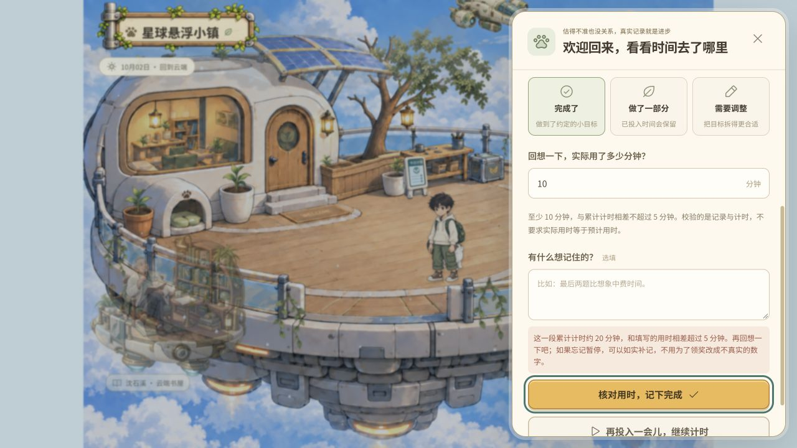
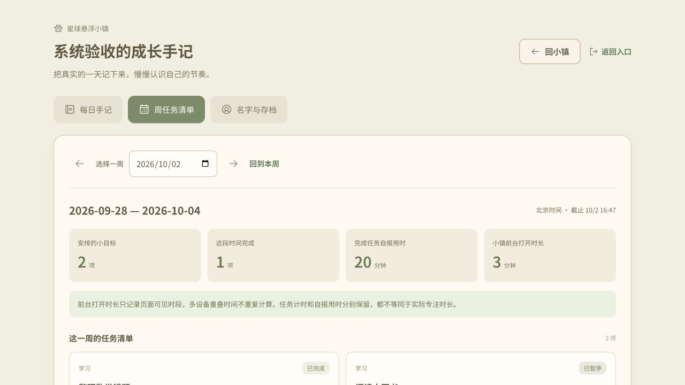
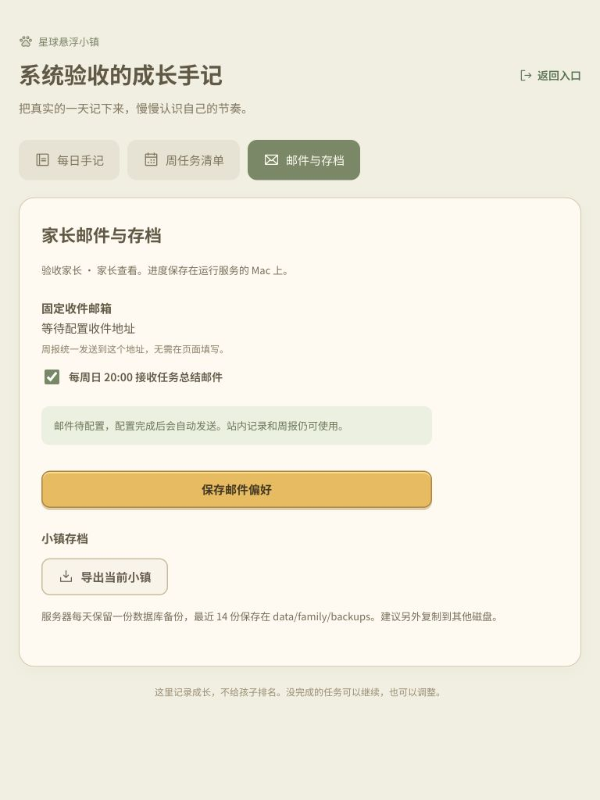

# 全系统体验与回归验收 · 2026-10-02

本轮覆盖三幕场景、现实任务、星球币、建设照料、家庭同步、存档和周报。页面使用独立临时 SQLite 服务（`run-system-audit.py`），未用真实孩子进度测试消费。现有真实服务仅用于核对编译文件交付。

## 本轮发现与修复

**活动任务导入会丢失最后一段计时。** `Store.import_save` 原来把 active 改为 paused 并清空 startedAt，但只保留此前 elapsedMs。例如此前已累计 5 分钟、又运行 15 分钟，导入后仅剩 5 分钟。

- 先添加回归测试，确认旧实现返回 300000 毫秒而预期 1200000 毫秒。
- 现在使用服务器导入时刻结算 startedAt 至当前时间的运行段，再暂停任务；开始时刻必须是合法数字且不早于创建、不晚于服务器当前时间。
- 不自动完成任务、不发放奖励；沿用最大累计时间限制，原始导入文件不改写。

## 页面流程

1. 名字登录、每日奖励与新手引导：正常。到访余额由 120 变为 130；引导说明现实行动、记录和探索，允许收起。
   
2. 平台拾币、任务回顾和建设：正常。角色到达金币后余额变为 131；20 分钟任务填写 10 分钟被温柔提醒，输入保留；填写 20 分钟完成，领取后 141，建设猫爬架后 131。第一幕目录仅猫爬架。
   
3. 温室动物互动和植物照料：正常。阿羽免费互动不扣币；海芋确认花费 3 币后余额 128，场景显示舒展素材。
   
4. 机械港成长与计划入口：正常。墨子确认升级花费 3 币，余额 125，显示折叠机械臂；今日计划仍是同一份任务与领奖状态。
   
5. 每日手记、周任务清单与家长入口：正常。记录包含实际任务、拾币、建设、照料和升级；自报用时与网页前台时长分别展示。家长无密码入口可用；未配置邮件明确显示待配置。
   
6. iPad 768×1024 竖屏：计划与家长设置无横向溢出，截图核验完成；Escape 关闭面板正常。音乐经主动点击进入播放状态，可暂停，未捕获浏览器控制台错误。
   
   

## 自动验证和交付

- `npm test`：70 项通过。包含金币概率与幂等、三幕路线、音乐生命周期、成长阶段、新手引导、每日奖励、存档兼容和同步版本处理。
- `.venv/bin/python -m unittest discover -s tests -p 'test_*.py'`：70 项通过。包含名字登录、权限与同源校验、计时与误差、重复操作、导入校验、记录统计、天气缓存、周报投递状态及本轮计时导入回归。
- `npm run test:sites`：4 项通过。
- `npm run build`、`npm run build:family`：通过，Sites 入口和家庭版产物完整。
- `dist/family` 共 73 个文件通过 4180 服务逐一请求，全部 HTTP 200 且内容与磁盘一致。
- 受保护的 Sites 配置、worker、构建脚本与测试文件无改动。数据库、mail-config.json、环境配置、本机依赖保持忽略。

## 验证边界

- 本次是桌面内置浏览器和 iPad 尺寸模拟，未使用真实 iPad Safari 或另一台旧 Mac 做实机兼容测试。
- 邮件通过模拟发送器验证成功、失败和结果未知，不向真实收件人发送测试邮件；未验证真实 SMTP 投递到达率。
- 音乐验证控件和播放状态及自动测试，未评价扬声器实际听感。截图和键盘检查不等于完整无障碍认证。
- 构建仍有既有主脚本超过 500 KB 的提示（家庭版约 558 KB，gzip 约 174 KB）；当前本地加载和素材校验通过，低性能旧设备尚需实机测量。
- 未发现本轮已覆盖流程中的其他阻断问题；这不代表对所有浏览器、网络异常和未来数据规模作零缺陷保证。
