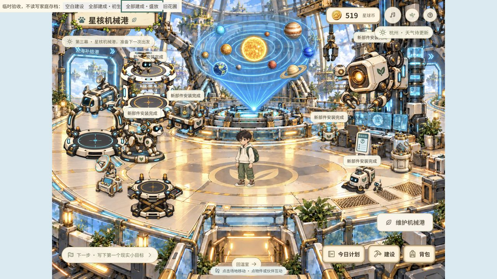
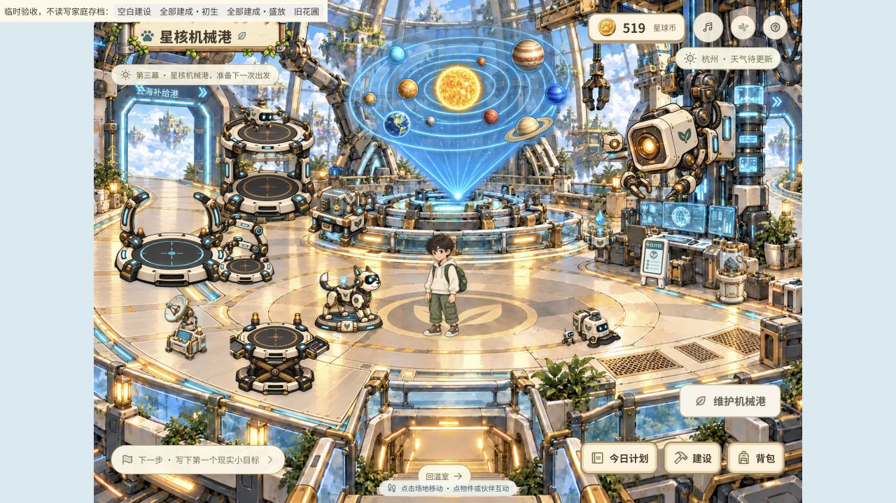
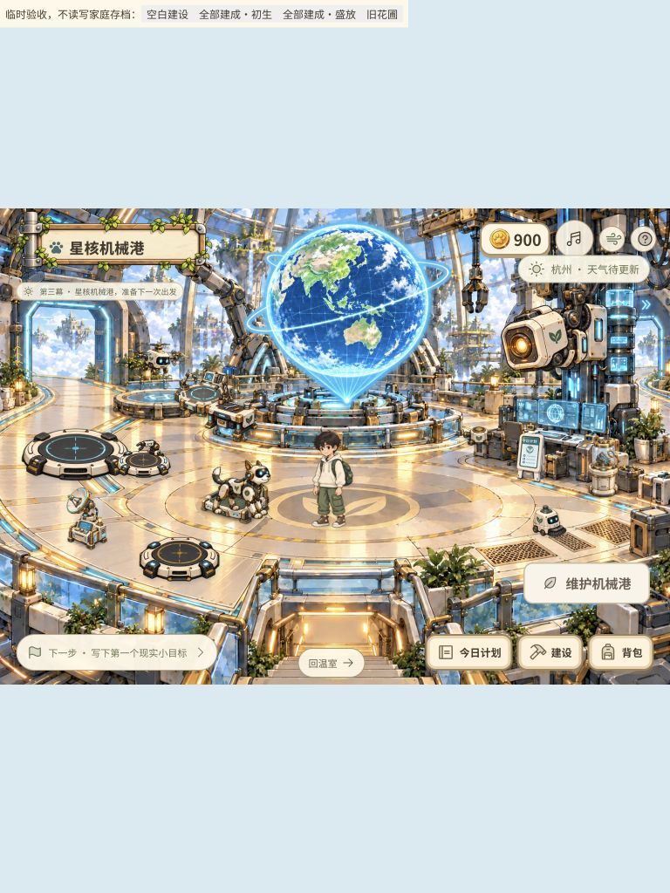
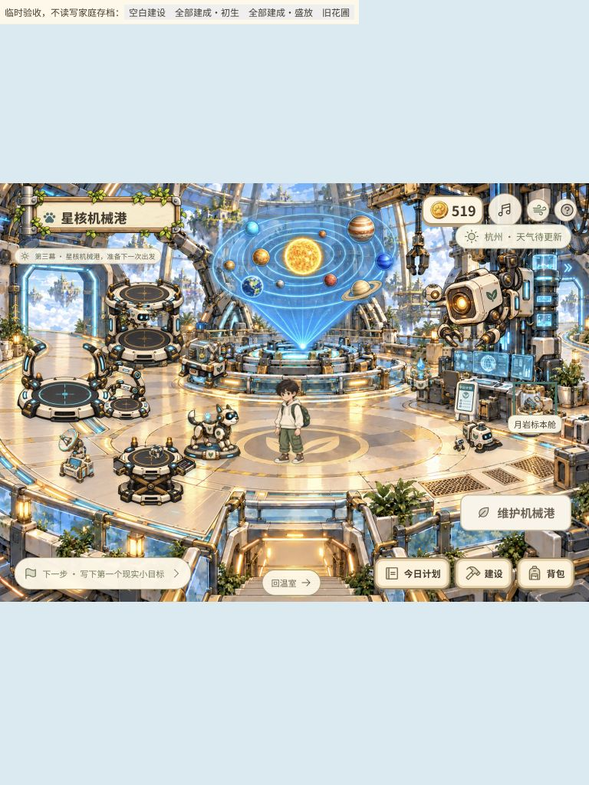

# 第三幕独立物件布局整理

范围：只调整星核机械港物件脚点、尺寸及相关互动坐标，保留现有底图、全息投影、墨子、补给路径和全部玩法。未使用真实孩子存档测试消费。

1. **调整前，左侧拥挤。** 停机坪、小巡、装配台及补给设备靠得过近，满级状态的小巡和清洁机器人比例偏大。中央全息投影、右侧智脑及原有建筑关系仍是本次保留的视觉依据。
   
2. **调整后，相关设施分组更明确。** 左后停机检修、左前补给与伙伴休息、中央全息展示、右侧智脑观测。小巡移出停机坪下方，装配台、能源柱、清洁机器人和无人机缩紧体量，通讯站与月岩舱沿边缘收拢。点击位置跟随展示位置；建设 ID、价格、存档与成长规则不变。
   
3. **旧设施与 iPad，已复核。** 768×1024 无横向溢出；旧充电坞不再遮住小巡双腿。桌面实际点击验证小巡、通讯站、装配台、能源柱、标本舱及今日计划，iPad 点击验证标本舱。保留至少 44 像素的独立热区；这不是完整无障碍审计。
   
   

验证：67 项前端测试通过，包含保存兼容、成长消费、补给/货箱路径、附加设施与原有入口不重叠。返回温室入口实测正常。家庭版构建成功，4180 服务实际返回的 HTML、JS 和 CSS 与构建文件一致；正式页面已进入第三幕且控制台无错误。原有主包超过 500 kB 的构建提示仍存在。

布局来源：`shared/workshop-layout.js`。底图与素材未重绘，补给舱、货箱、无人机时序与路线未改动。第一幕窄窗口入口与花草的既有热区问题不属于本次第三幕整理范围；截图工具曾返回裁切图，已舍弃并用独立验收页面重新采集。
